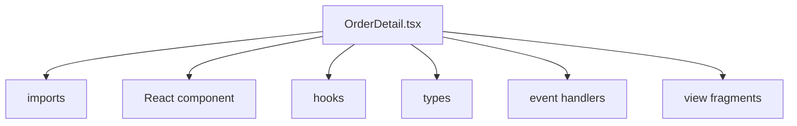
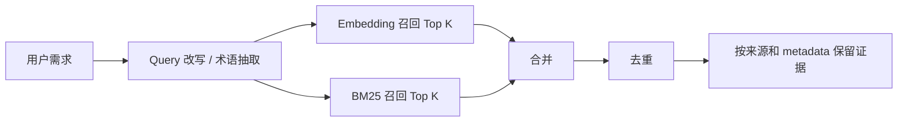

<div class="hero">
  <div class="eyebrow">RAG for Engineering Knowledge</div>
  <h1>让模型先看见上下文</h1>
  <p class="subtitle">从历史需求、BC、方案设计、Proto 到代码结构，构建面向内部研发流程的知识增强链路。</p>
  <div class="hero-line"></div>
  <div class="hero-meta">
    <span>需求理解</span>
    <span>BC 预估</span>
    <span>方案设计</span>
    <span>代码建议</span>
  </div>
</div>

---

## 什么是 RAG

RAG，全称 **Retrieval-Augmented Generation**，也就是 **检索增强生成**。

<div class="big-flow">
  <FlowNode kicker="Step 01" title="理解用户问题" tone="cyan" />
  <FlowNode kicker="Step 02" title="检索内部资料" tone="cyan" />
  <FlowNode kicker="Step 03" title="重组上下文" tone="cyan" />
  <FlowNode kicker="Step 04" title="生成答案" tone="cyan" />
</div>


<div class="callout mt-8">RAG 的主要作用，就是给模型提供更加精确和可靠的上下文信息。</div>

---

## Embedding 解决语义相似

Embedding 是把文本、代码、需求文档转换成向量，用来判断语义相似度。

<div class="grid-2">
  <div class="panel">
    <h3>字面不同</h3>

```text
用户可以修改手机号
支持用户变更绑定手机
手机号换绑能力
```
  </div>
  <div class="panel">
    <h3>语义相近</h3>

```text
查询：我们现在要做手机号换绑

召回：
- 修改手机号需求
- 账号安全信息变更
- 绑定信息变更 Proto
```
  </div>
</div>

<div class="callout mt-8">Embedding 适合处理自然语言表达、历史需求关联和业务意图理解。</div>

---

## 调用链路纵览

<div class="rag-flowchart">
  <div class="flow-line">
    <div class="flow-card"><span>01</span><strong>内部资料源</strong><small>需求 / 配齐 / PMO / proto</small></div>
    <div class="flow-arrow">→</div>
    <div class="flow-card"><span>02</span><strong>解析与切分</strong><small>按文档类型保留语义边界</small></div>
    <div class="flow-arrow">→</div>
    <div class="flow-card"><span>03</span><strong>摘要与元数据</strong><small>标题、路径、符号、业务域</small></div>
  </div>

  <div class="flow-branch">
    <div class="flow-branch-card"><span>04A</span><strong>Embedding 索引</strong><small>语义相似召回</small></div>
    <div class="flow-merge">合并去重</div>
    <div class="flow-branch-card"><span>04B</span><strong>BM25 索引</strong><small>接口名、字段名精确匹配</small></div>
  </div>

  <div class="flow-line flow-line--five">
    <div class="flow-card"><span>05</span><strong>多路粗召回</strong><small>候选资料池</small></div>
    <div class="flow-arrow">→</div>
    <div class="flow-card"><span>06</span><strong>Rerank 重排</strong><small>关键证据靠前</small></div>
    <div class="flow-arrow">→</div>
    <div class="flow-card"><span>07</span><strong>Chunk Summary</strong><small>压缩为证据卡片</small></div>
    <div class="flow-arrow">→</div>
    <div class="flow-card"><span>08</span><strong>Prompt 重组</strong><small>按关系组织上下文</small></div>
    <div class="flow-arrow">→</div>
    <div class="flow-card"><span>09</span><strong>研发输出</strong><small>需求理解 / BC / 方案 / 代码</small></div>
  </div>
</div>

---

## 今天主要讲 4 个优化点

<div class="optimization-map">
  <div>
    <span>01</span>
    <strong>Chunk 切分</strong>
    <p>不同资料用不同语义边界，保证召回片段完整。</p>
  </div>
  <div>
    <span>02</span>
    <strong>混合检索</strong>
    <p>Embedding 负责语义，BM25 负责精确 token。</p>
  </div>
  <div>
    <span>03</span>
    <strong>Rerank 重排</strong>
    <p>从粗召回结果中把真正重要的内容排到前面。</p>
  </div>
  <div>
    <span>04</span>
    <strong>Prompt 重组</strong>
    <p>把零散 chunk 整理成模型能正确使用的上下文。</p>
  </div>
</div>

---

<div class="section-title">
  <div>
    <div class="eyebrow">Optimization 01</div>
    <h1>Chunk 切分：上下文质量的第一关</h1>
    <p class="subtitle mx-auto">RAG 的效果首先取决于喂给模型的上下文是否完整、干净、可解释。</p>
  </div>
</div>

---

## Chunk 太大或太小都会出问题

<div class="grid-2">
  <ComparePanel title="Chunk 太大" type="bad">
    <ul class="compact-list">
      <li>召回结果包含很多无关内容。</li>
      <li>上下文窗口被噪音占用。</li>
      <li>模型需要在长文本中重新找重点。</li>
    </ul>
  </ComparePanel>
  <ComparePanel title="Chunk 太小" type="bad">
    <ul class="compact-list">
      <li>语义不完整。</li>
      <li>代码函数、Proto 关系被拆散。</li>
      <li>背景、结论和接口定义分离。</li>
    </ul>
  </ComparePanel>
</div>

<div class="principle mt-8">原则：不要按固定长度优先切，先按资料类型找语义边界。</div>

---

## 需求文档：固定切分的问题

<div class="grid-2">
  <div>

```text
# 会员权益升级需求

背景：
当前会员权益体系中，普通会员、黄金会员、
黑钻会员的权益规则分散在不同运营配置中...

目标：
支持运营后台统一配置会员权益...

范围：
权益页展示、运营配置、灰度策略和实时生效规则...
```

  </div>
  <div class="panel">
    <h3>问题</h3>
    <ul class="compact-list">
      <li>规则片段缺少完整业务背景。</li>
      <li>目标片段不知道配置范围和生效约束。</li>
      <li>标题和上文语义在短 chunk 中丢失。</li>
      <li>相似需求召回不稳定。</li>
    </ul>
  </div>
</div>

---

## 需求文档：文档摘要 + Chunk 摘要

```json
{
  "doc_title": "会员权益升级需求",
  "doc_summary": "支持运营后台统一配置会员权益，不同会员等级展示不同权益，并要求权益变更后在用户侧实时生效。",
  "chunk_summary": "描述权益配置实时生效规则、灰度范围和用户可见性要求。",
  "chunk_text": "3. 支持权益变更后实时生效。灰度策略...",
  "metadata": {
    "doc_type": "requirement",
    "business_domain": "member",
    "key_terms": ["会员权益", "运营配置", "实时生效"]
  }
}
```

<div class="callout mt-6">Embedding 内容使用：文档标题 + 文档摘要 + Chunk 摘要 + Chunk 原文。</div>

---

## 代码文件：不能按行数切

<div class="grid-2">
  <div>

```go
func BuildMemberBenefitConfig(userId int64, level MemberLevel) *BenefitConfig {
    config := loadDefaultConfig()

    if level == MemberLevelGold {
        config.EnableCoupon = true
        config.CouponAmount = 20
    }

    if level == MemberLevelBlack {
        config.EnableCoupon = true
        config.CouponAmount = 50
        config.EnableExclusiveService = true
    }

    return config
}
```

  </div>
  <div class="panel">
    <h3>问题</h3>
    <ul class="compact-list">
      <li>后半段不知道函数名和入参。</li>
      <li>前半段没有完整分支和返回逻辑。</li>
      <li>模型无法准确判断职责。</li>
      <li>生成复用建议时容易漏上下文。</li>
    </ul>
  </div>
</div>

---

## 代码文件：Tree-sitter 按语法结构切



<div class="grid-3 mt-8">
  <div class="panel"><strong>语法边界</strong><br><span class="muted">组件、Hook、类型、事件处理函数。</span></div>
  <div class="panel"><strong>符号信息</strong><br><span class="muted">文件路径、组件名、props、起止行。</span></div>
  <div class="panel"><strong>业务摘要</strong><br><span class="muted">把页面职责转换成可检索语义。</span></div>
</div>

---

## 代码 Chunk 的存储形态

```json
{
  "file_path": "src/pages/order/OrderDetail.tsx",
  "language": "tsx",
  "symbol_type": "react_component",
  "symbol_name": "OrderDetailPage",
  "component_signature": "function OrderDetailPage({ orderId }: OrderDetailPageProps)",
  "summary": "订单详情页负责拉取订单信息，展示订单状态、付款信息、司机乘客信息等。",
  "chunk_text": "function OrderDetailPage(...) { return <OrderDetailView ... /> }",
  "metadata": {
    "repo": "cms-web",
    "module": "order",
    "start_line": 18,
    "end_line": 126
  }
}
```

---

<div class="section-title">
  <div>
    <div class="eyebrow">Optimization 02</div>
    <h1>混合检索：语义召回 + 精确匹配</h1>
    <p class="subtitle mx-auto">有时候精确关键词匹配更符合搜索条件，例如代码枚举值、关键需求名称等。</p>
  </div>
</div>

---

## 只用语义相关性的不足

<div class="grid-2">
  <div class="panel">
    <h3>语义相关性擅长</h3>
    <ul class="compact-list">
      <li>历史需求相似性。</li>
      <li>自然语言意图理解。</li>
      <li>同义表达召回。</li>
    </ul>
  </div>
  <div class="panel accent-panel">
    <h3>只看语义相关性不稳定的场景</h3>
    <ul class="compact-list">
      <li>明确搜索某个代码枚举值时，字面命中通常比语义相似更可靠。</li>
      <li>需求标题、项目代号、实验名称需要按原词匹配。</li>
      <li>错误码、埋点名、灰度开关等短 token 缺少足够语义。</li>
      <li>表名、字段名和文件路径更依赖命名约定。</li>
    </ul>
  </div>
</div>

<div class="callout mt-8">精确关键词的价值不只来自语义，也来自业务命名、代码约定和工程资产的稳定标识。</div>

---

## BM25 补齐精确 token 召回

<div class="grid-2">
  <div class="panel">
    <h3>查询</h3>

```text
GetMemberBenefitConfig 返回了哪些字段？
```

  </div>
  <div class="panel">
    <h3>BM25 优先命中</h3>

```proto
rpc GetMemberBenefitConfig(
    GetMemberBenefitConfigRequest)
    returns (GetMemberBenefitConfigResponse);

message GetMemberBenefitConfigResponse {
  repeated BenefitItem benefits = 1;
}
```

  </div>
</div>

---

## 混合召回的合并逻辑



<div class="grid-2 mt-8">
  <div class="panel"><strong>Embedding</strong><br><span class="muted">找“会员权益实时生效”相关需求和方案。</span></div>
  <div class="panel"><strong>BM25</strong><br><span class="muted">找 <code>GetMemberBenefitConfig</code>、<code>BenefitItem</code>、文件路径。</span></div>
</div>

---

<div class="section-title">
  <div>
    <div class="eyebrow">Optimization 03</div>
    <h1>Rerank：对原始召回结果<br/>进行重排序</h1>
    <p class="subtitle mx-auto">向量检索找到的结果，未必真的是最适合回答用户问题的结果，所以需要更强的模型来判断哪个结果最真正回答用户问题。</p>
  </div>
</div>

---

## 为什么需要 Rerank

<div class="grid-2">
  <ComparePanel title="粗召回 Top 50" type="bad">
    <ul class="compact-list">
      <li>历史需求文档 20 条。</li>
      <li>Proto 片段 15 条。</li>
      <li>代码片段 15 条。</li>
      <li>很多只是泛相关。</li>
    </ul>
  </ComparePanel>
  <ComparePanel title="Prompt 只能放 Top 5-10" type="good">
    <ul class="compact-list">
      <li>真正关键的 chunk 必须排前面。</li>
      <li>无关片段不能挤占上下文。</li>
      <li>排序质量直接影响答案质量。</li>
    </ul>
  </ComparePanel>
</div>

---

## Rerank 示例

<div class="grid-2">
  <ComparePanel title="粗召回" type="bad">
    <ol>
      <li>会员权益升级需求</li>
      <li>会员等级展示文档</li>
      <li>运营配置后台说明</li>
      <li>权益变更实时生效方案</li>
      <li>benefit.proto 接口定义</li>
      <li>用户积分过期规则</li>
    </ol>
  </ComparePanel>
  <ComparePanel title="Rerank 后" type="good">
    <ol>
      <li>权益变更实时生效方案</li>
      <li>会员权益升级需求</li>
      <li>MemberBenefitService.GetMemberBenefitConfig</li>
      <li>运营配置后台说明</li>
      <li>会员等级展示文档</li>
      <li>用户积分过期规则</li>
    </ol>
  </ComparePanel>
</div>

---

<div class="section-title">
  <div>
    <div class="eyebrow">Optimization 04</div>
    <h1>Prompt重组：把碎片chunks变成<br/>精确上下文</h1>
    <p class="subtitle mx-auto">检索结果不能直接堆给模型，需要显式说明来源、关系、可复用点和风险。</p>
  </div>
</div>

---

## 为什么不能直接拼接 Chunk

<div class="grid-2">
  <div>

```text
用户需求：会员权益实时生效，请生成技术方案。

相关资料：
Chunk 1: 会员权益升级需求...
Chunk 2: GetMemberBenefitConfig proto...
Chunk 3: BuildMemberBenefitConfig 代码...
Chunk 4: 运营后台配置说明...
Chunk 5: 用户积分过期规则...
```

  </div>
  <div class="panel">
    <h3>问题</h3>
    <ul class="compact-list">
      <li>不知道哪些 chunk 最重要。</li>
      <li>不知道 chunk 之间的关系。</li>
      <li>代码缺少业务解释。</li>
      <li>历史需求和当前问题的关系不明确。</li>
      <li>核心信息容易被长 prompt 淹没。</li>
    </ul>
  </div>
</div>

---

## Chunk Summary：证据卡片

```json
{
  "chunk_id": "proto-member-benefit-config",
  "source_type": "proto",
  "relevance_reason": "该接口可用于查询用户权益配置，是当前需求的核心候选接口。",
  "key_points": [
    "服务名：MemberBenefitService",
    "接口名：GetMemberBenefitConfig",
    "返回 BenefitItem 列表"
  ],
  "risk_or_gap": [
    "当前接口未体现配置版本号",
    "不确定是否支持实时生效"
  ]
}
```

---

## Context 重组后的结构

<div class="context-pack">
  <div><span>01</span><strong>当前需求</strong><p>目标、业务域、角色、触发场景。</p></div>
  <div><span>02</span><strong>历史相关需求</strong><p>背景、范围、相似点、差异点。</p></div>
  <div><span>03</span><strong>可复用 Proto</strong><p>service、rpc、request、response、字段。</p></div>
  <div><span>04</span><strong>可复用代码</strong><p>文件、函数、职责、调用点、风险。</p></div>
  <div><span>05</span><strong>风险和缺口</strong><p>实时性、缓存、兼容性、灰度和待确认问题。</p></div>
</div>

---

## 优化方案总结

| 阶段 | 解决的问题 | 优化方案 | 价值 |
| --- | --- | --- | --- |
| Chunk | 固定切分导致语义不完整 | 按需求、代码、Proto 分类型切分 | 保留上下文完整性 |
| 向量化 | 只存原文语义不足 | 标题、路径、函数名、摘要、metadata 入索引 | 增强检索语义 |
| 检索 | 语义和精确 token 难兼顾 | Embedding + BM25 混合检索 | 同时覆盖意图和接口名 |
| 排序 | 粗召回结果有噪音 | Rerank 二次排序 | 提升 Top 结果质量 |
| 生成 | 直接拼接 chunk 混乱 | Chunk Summary + Prompt 重组 | 提高答案完整性 |

---

## 当前不足

<div class="grid-2">
  <div class="panel accent-panel">
    <StageBadge label="Rerank 未完全实现" tone="cyan" />
    <p class="mt-4">粗召回后结果排序仍然不够稳定，真正关键的 chunk 可能没有排在前面。</p>
    <p class="muted">影响：prompt 可能引入不够相关的内容，复杂需求回答偏泛。</p>
  </div>
  <div class="panel accent-panel">
    <StageBadge label="Chunk 重组未完全实现" tone="cyan" />
    <p class="mt-4">召回后的 chunk 还没有完全结构化整理，不同来源的信息之间缺少关系表达。</p>
    <p class="muted">影响：历史需求、Proto、代码之间的联系不够清晰。</p>
  </div>
</div>

---

## 后续方向

<div class="grid-3">
  <div class="panel">
    <h3>VL 多模态 Embedding</h3>
    <p>支持图片、截图、流程图和设计稿等视觉资料入库，让需求和方案里的非文本信息也能被召回。</p>
  </div>
  <div class="panel">
    <h3>Rerank 增强</h3>
    <p>补齐更稳定的二阶段排序，让历史需求、代码片段和精确关键词结果按当前问题的重要性重排。</p>
  </div>
  <div class="panel">
    <h3>Resummary 增强</h3>
    <p>对召回结果做面向当前问题的再摘要，压缩噪音，补充来源、关系、缺口和可复用点。</p>
  </div>
</div>

<div class="principle mt-8">后续重点：补齐多模态资料、排序稳定性和上下文再组织能力，让召回结果更完整、更可用。</div>
